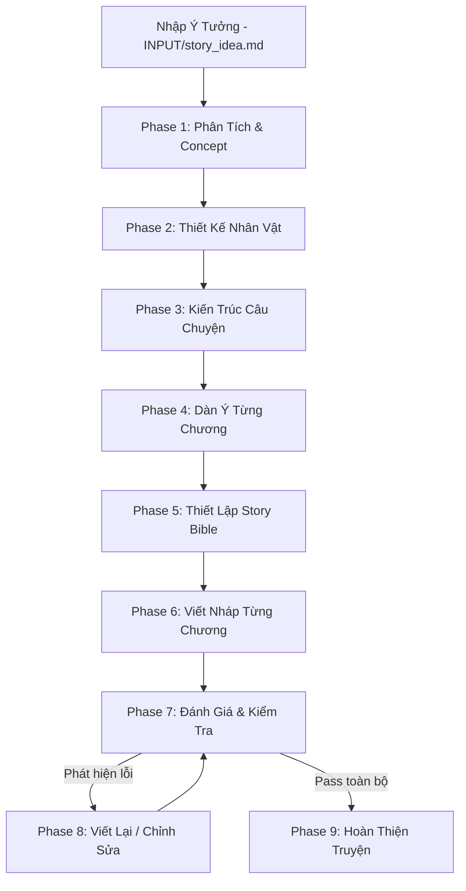

# AI Short Romance Story Generation Framework

Framework này là một hệ thống sản xuất truyện ngôn tình ngắn thông qua AI, chú trọng vào chất lượng, sự nhất quán (consistency), sự phát triển tình cảm (romance progression) và chiều sâu cảm xúc.

## Cấu trúc thư mục

Dự án được chia thành hai phần chính: **Hệ thống (System)** và **Truyện (Stories)**.

- `system/`: Chứa toàn bộ các file dùng chung để cấu hình và điều khiển AI.
  - `CONFIG/`: Cấu hình cho truyện (thể loại, văn phong).
  - `RULES/`: Các luật bắt buộc AI phải tuân thủ (cốt truyện, nhân vật).
  - `SKILLS/`: Các kỹ năng đóng vai trò như agent (viết chương, kiểm tra).
  - `WORKFLOW/`: Quy trình các bước thực hiện.
  - `TEMPLATES/`: Các biểu mẫu đầu ra.

- `stories/`: Chứa các truyện bạn tạo ra. Mỗi truyện là một folder riêng biệt.
  - `INPUT/`: Nơi nhập ý tưởng ban đầu của truyện (`story_idea.md`).
  - `MEMORY/`: Nơi lưu trữ thông tin canon của truyện (Story Bible, Timeline).
  - `OUTPUT/`: Nơi lưu trữ bản nháp, bài đánh giá và bản hoàn chỉnh của truyện.
  - `STATUS.md`: Xem trạng thái hiện tại của truyện.

*Lưu ý: Để tạo truyện mới, hãy copy folder `stories/_template_story/` và đổi tên.*

## Quy trình sử dụng (Workflow)
Quy trình tạo một truyện ngắn yêu cầu tuân thủ nghiêm ngặt từng bước để đảm bảo tính logic, chiều sâu nhân vật và phát triển cảm xúc. Bạn **KHÔNG** yêu cầu AI viết toàn bộ truyện trong một lần. 

Dưới đây là biểu đồ quy trình chuẩn:

*Các Phase 1-9 ở trên khớp chính xác với các Phase trong `system/WORKFLOW/main_workflow.md` — đây là tên gọi duy nhất được dùng trong `STATUS.md` (xem `system/RULES/core_rules.md` Rule 8). Danh sách lệnh/prompt mẫu bên dưới chỉ là hướng dẫn thực hành, không phải số Phase.*

## Các lệnh và Prompt mẫu

Mỗi bước đều có lệnh rút gọn tương ứng (mô phỏng). Nếu lệnh rút gọn không hoạt động, hãy dùng các **Prompt mẫu** dưới đây gửi vào khung chat:

### 1. Chuẩn bị ý tưởng
- **Thao tác:** Copy folder `_template_story` thành truyện mới (VD: `01_new_story`). Mở file `INPUT/story_idea.md` của truyện đó và điền ý tưởng.

### 2. Phân tích ý tưởng
- **Lệnh rút gọn:** `/analyze-idea`
- **Prompt mẫu:** 
> "Dựa trên kỹ năng `idea_analyzer` trong thư mục `system/SKILLS/`, hãy phân tích ý tưởng của truyện ở `stories/01_ceo_ex_boyfriend/INPUT/story_idea.md`. Xác định Concept, Genre, và thông tin còn thiếu. Viết kết quả ra `OUTPUT/outline/01_story_concept.md`."

### 3. Thiết kế nhân vật
- **Lệnh rút gọn:** `/create-characters`
- **Prompt mẫu:** 
> "Dựa trên concept vừa tạo, đóng vai `character_designer` thiết kế chi tiết 2 nhân vật chính (chú ý điểm mạnh, yếu, Want vs Need). Lưu vào `MEMORY/character_memory.md` của truyện."

### 4. Xây dựng cốt truyện & Dàn ý
- **Lệnh rút gọn:** `/create-outline` & `/create-chapters`
- **Prompt mẫu:** 
> "Sử dụng `story_architect`, `romance_architect`, `conflict_designer` và `chapter_planner`. Tạo Outline tổng thể cho truyện và Dàn ý chi tiết cho 8 chương. Yêu cầu mỗi chương phải có sự phát triển tình cảm. Viết ra `OUTPUT/outline/`."

### 5. Chốt Canon & Viết bản nháp chương 1
- **Lệnh rút gọn:** `/write-chapter 1`
- **Prompt mẫu:** 
> "Cập nhật các thông tin vào `MEMORY/story_bible.md`. Sau đó, dùng `scene_writer`, `emotion_writer` và `dialogue_writer` để viết bản nháp Chương 1. Tuân thủ nghiêm ngặt quy tắc Show, don't tell. Viết ra `OUTPUT/drafts/chapter_1.md`."

**⚠️ LƯU Ý QUAN TRỌNG VỀ VIẾT CHƯƠNG (RULE 7):**
- AI chỉ được phép viết **từng chương một**. 
- Sau khi AI viết xong một chương, bạn cần đọc, đưa ra phản hồi hoặc chỉnh sửa. AI sẽ tự động cập nhật cả 4 file `MEMORY` (`story_bible.md`, `timeline.md`, `relationship_memory.md`, `unresolved_threads.md`) để các chương sau không bị mâu thuẫn.
- AI sẽ **DỪNG LẠI** chờ bạn xác nhận (Approve). Chỉ khi bạn gõ "Approve, viết tiếp chương 2" thì AI mới được phép viết chương tiếp theo.

### 6. Đánh giá và Chỉnh sửa
- **Lệnh rút gọn:** `/review` & `/rewrite`
- **Prompt mẫu:** 
> "Đóng vai Plot Hole Checker, Continuity Checker và Romance Checker để đánh giá Chương 1. Nếu có lỗi CRITICAL hoặc MAJOR, hãy chỉ rõ lỗi và tự động viết lại để sửa lỗi đó."

### 7. Hoàn thiện
- **Lệnh rút gọn:** `/finalize`
- **Prompt mẫu:**
> "Sử dụng `final_editor` kiểm tra toàn bộ truyện. Nếu PASS mọi khâu, hãy ghép các chương vào `OUTPUT/final/final_story.md`."

---

*Mẹo: Bạn có thể dùng lệnh `/status` bất cứ lúc nào để yêu cầu AI đọc và cập nhật file `STATUS.md` của truyện đó.*\n